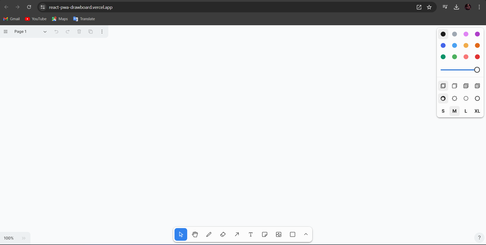
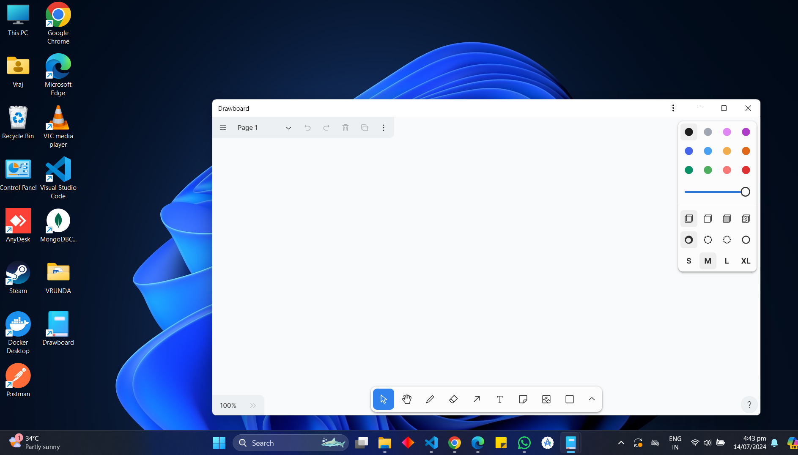
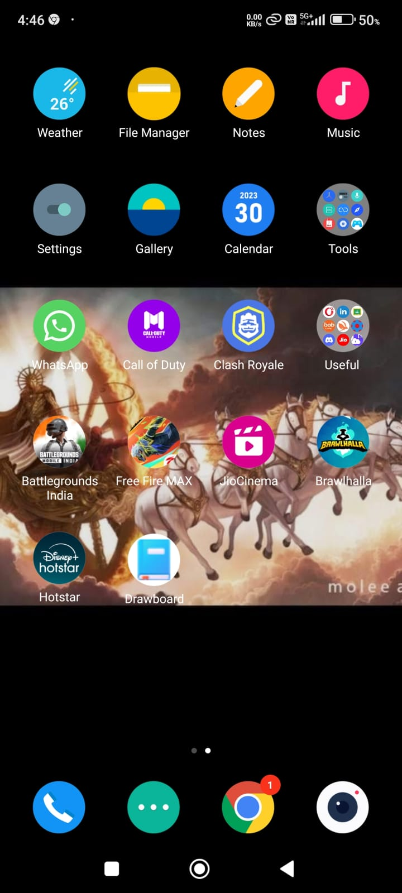

# DrawBoard

DrawBoard is a modern Progressive Web App (PWA) built with Vite + React, offering fast loading times, offline access, and a seamless user experience for educational content.

## Live Demo

Check out the live demo at: [DrawBoard Live](https://gyann-slate.vercel.app/)

## Features

- Fast loading times
- Offline access
- App-like experience on any device

## Screenshots

### Browser View

### Laptop Download

### Mobile Download

